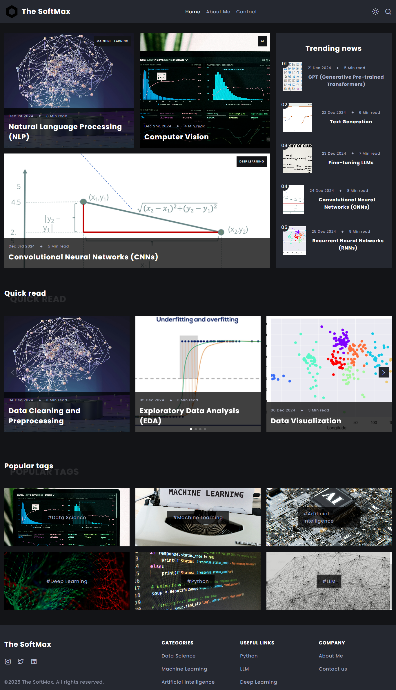
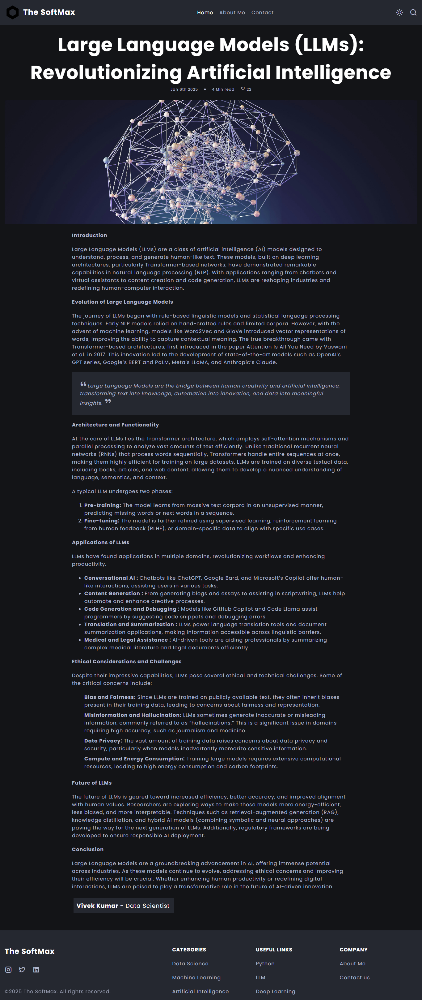
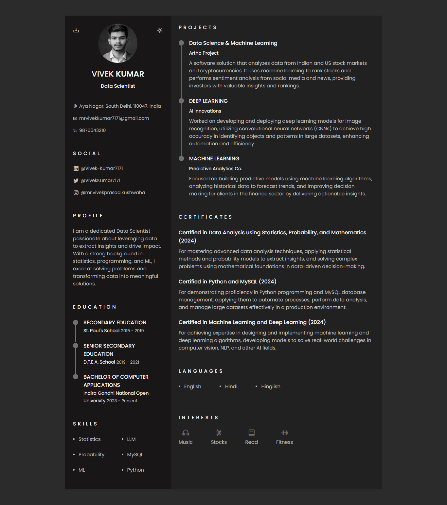

# TheSoftmax.com – AI/ML/DS Educational Blog & Resume Site

Welcome to **TheSoftmax.com**, a personal website built to showcase my resume and regularly post educational content on Artificial Intelligence (AI), Machine Learning (ML), and Data Science (DS). This project is designed to help students, beginners, and enthusiasts learn through well-structured blog posts, practical examples, and curated resources.

## 🌐 Website Structure

The website contains the following major components:

- **Homepage (index.html)** – Introduction to the website and latest blog updates.
- **Resume Page (Vivek-Kumar.html)** – A detailed, stylized HTML version of my resume.
- **Post Page (post.html)** – A list of individual blog posts with titles, thumbnails, reading times, and like counts.
- **Individual Blog Pages** – Each post includes a full article with visuals, estimated reading time, publication date, and interactive like functionality.
- **Minimal Music Player** – A clean, minimal, and modern **web-based music player** that plays audio across **Hindi, English, and regional languages** — capturing a wide spectrum of **moods and emotions**. Built for those who love music without distractions.

### 🌟 Features of Music Player

- 🎶 **Multi-language tracks** – Hindi, English, and more  
- 💫 **Emotion-based variety** – love, energy, calm, and more  
- 🎧 **No visuals, just sound** – low data usage  
- 🌓 **Dark mode only** – clean, night-friendly interface  
- ⏯️ **Core music controls** – Play, Pause, Next, Previous  
- 🔀 **Shuffle & 🔁 Repeat** – toggle with smart feedback  
- ⌨️ **Keyboard shortcuts** – control volume & seek without mouse  
- 🔊 **Volume memory** – remembers your sound preference  
- ⚡ **Lightweight** – fast, responsive, and clutter-free  

## 📂 Tech Stack

- **Frontend**: HTML5, CSS3 (Dark-themed), JavaScript
- **Hosting**: GitHub Pages
- **Domain**: [TheSoftmax.com](https://thesoftmax.com) via Hostinger
- **Deployment**: Manual deployment using Git and GitHub Pages

## 🚀 Getting Started

If you want to run this website locally:

```bash
git clone https://github.com/yourusername/thesoftmax.git
cd thesoftmax
# Open index.html in your browser
```

Or, just open the `index.html` file directly in your browser.

## 🧠 Features

- Clean and responsive layout for all devices.
- Like counter on each post using local storage (no backend).
- Structured format for educational blog posts.
- Resume formatted in a professional and stylized way.
- Fully static—easy to host and manage.

## 🌍 Custom Domain Setup with Hostinger

To connect your GitHub Pages website with a custom domain purchased from Hostinger, follow these steps:

### Step 1: Configure DNS in Hostinger

1. Go to your Hostinger account and open the **DNS Zone Editor** for your domain.
2. Add or edit the following DNS records:

| Type | Name     | Value                         |
|------|----------|-------------------------------|
| A    | @        | `185.199.108.153`             |
| A    | @        | `185.199.109.153`             |
| A    | @        | `185.199.110.153`             |
| A    | @        | `185.199.111.153`             |
| CNAME | www    | `yourusername.github.io`       |

> Replace `yourusername.github.io` with your GitHub Pages username URL.

### Step 2: Add a CNAME File to GitHub

1. Inside your GitHub repository root, create a file named `CNAME`.
2. Add only your domain name (without `https://`) inside the file, for example:

```
thesoftmax.com
```

3. Commit and push this to your GitHub repo:

```bash
git add CNAME
git commit -m "Added custom domain"
git push
```

### Step 3: Enable GitHub Pages

1. Go to your GitHub repository > **Settings** > **Pages**.
2. Under "Custom domain", enter `thesoftmax.com`.
3. Check the "Enforce HTTPS" option once the domain connects properly.

Your domain should now point to your GitHub Pages website!

## 📸 Screenshots

*(Optional: Add screenshots of your website homepage, resume page, and a sample blog post.)*




## 📫 Contact

Feel free to connect with me on [LinkedIn](https://www.linkedin.com/in/Vivek-Kumar7171/) or check out more on [TheSoftmax.com](https://thesoftmax.com).